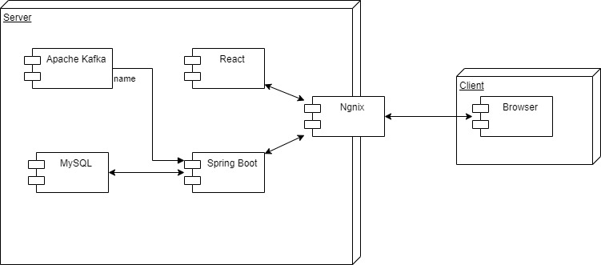

# CryptoYard

## Architecture

## Workflow

In this project there are no specific roles amoung the members. You can work with something you find fun or interesting and helps towards the milestone.

Heres the general workflow:

1. Find an issue you want to work with from the listing. If you want to work with something that is currently not listed, you can create an issue yourself specifying what you want to work with.
2. When you have your issue, create a branch from the dev branch named _issue_number-something-describing-the-issue_. E.g. _43-add-workflow-to-readme_.
3. Work with the issue in your newly created branch and have fun with it.
4. When you have finished your issue, send a pull request to pull your branch back into the dev branch. Now someone else can review what you've worked with and approve it. (P.s. if it takes too long for someone else to aprove it, you can merge it yourself into the dev branch.)

**Note:** The main branch should always be functional and operational.
