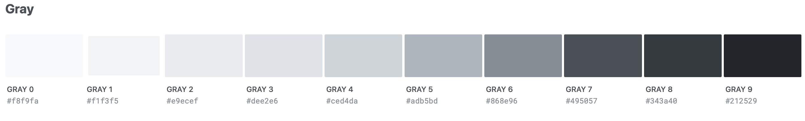
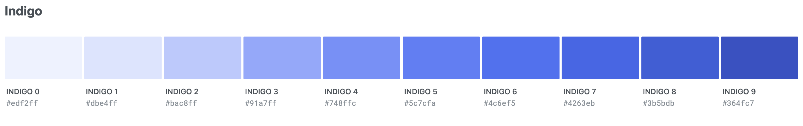
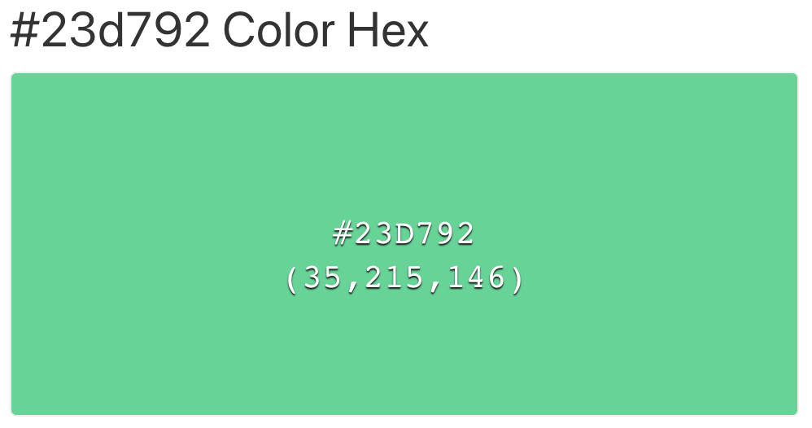
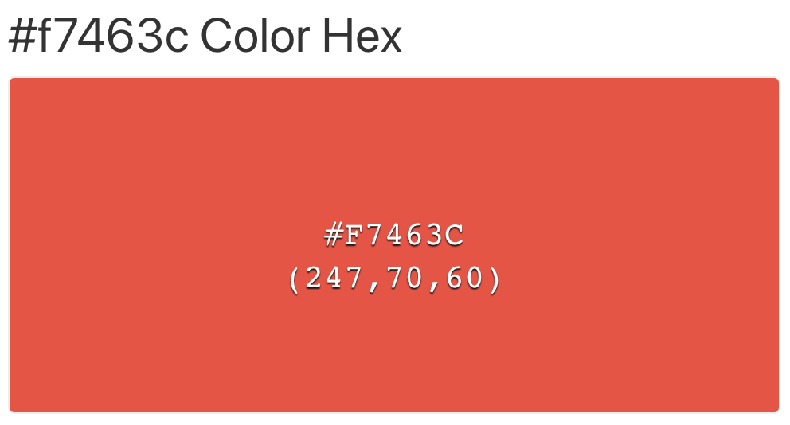

# Design Guidelines

## 1. Color

**Main color**

**Accent color**

**Success color**

**Error color**

\*Example use-case of success and error color:

- Display profit (success color)
- Someone tries to login with wrong user information (error code)

### 1.1. Light theme

For light theme, use the left specter of the main color for backgrounds and the right specter of the main color for text and foreground.

### 1.2 Dark theme

For dark theme, use the right specter of the main color for backgrounds and the left specter of the main color for text and foreground.

## 2. Typography

- Sans-serif text for both headings and body text
- Headings and other important text should use a bolder version of the fonr to create a visual hierarchy.

**Font:** Robot, sans-serif

**Font size:** 8.19px - 10.24px - 12.80px - 16.00px - 20.00px - 25.00px - 31.25px - 39.06px - 48.83px

## 3. Whitespace

Use whitespace to separate element from each other.

**Spaceing guideline:** 2px – 4px – 8px – 16px – 24px – 32px – 48px – 64px – 80px – 96px – 128px

## 4. Icons

Icons should not be used as a decorative element, rather as a replacement for text so users can more easily identify the elements of the page. E.g., the navigation on mobile devices.

## 5. Border rounding

Some border rounding should be applied to elements that are in a box shape. However, not to rounded. Something between 5 - 15px.

## 6. Shadows

For boxes and elements that need to stick out, use a tiny box shadow.
